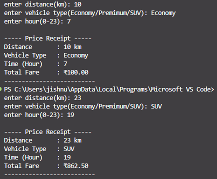

# FareCalc Travel Optimizer (Python)

This project calculates the ride fare based on distance, vehicle type, and time of day.
It also applies surge pricing during peak hours.

---

## ⚙️ Features

* Fare calculation using dictionary rates
* Surge pricing (5 PM – 8 PM)
* Input validation for vehicle type
* Displays formatted price receipt

---
## 📸 Sample Output

---

## Author

Jishnu
